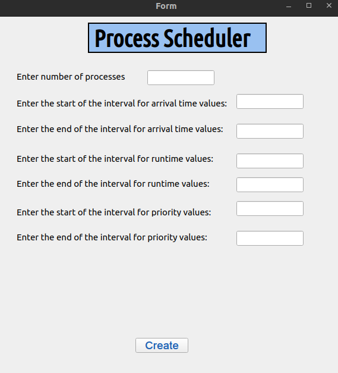
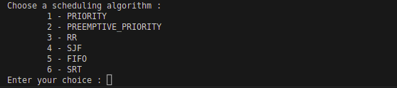
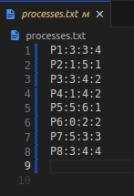
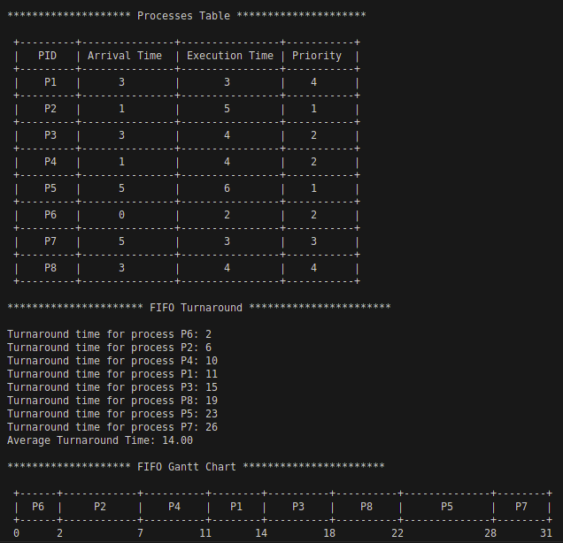
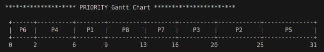
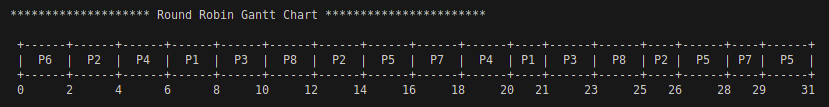
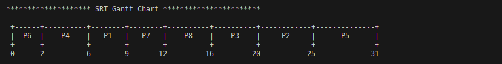

# Project Title
Process Scheduler Project

## Table of Contents

- [Overview](#overview)
- [Getting Started](#getting-started)
  - [Cloning the Repository](#cloning-the-repository)
  - [Building the Project](#building-the-project)
  - [Generating Processes File](#generating-processes-file)
  - [Running the Code with Generated Processes](#running-the-code-with-generated-processes)
  - [Result](#result)
- [Usage](#usage)

## Overview

This project is designed to simulate process scheduling algorithms and provide insights into the performance of these algorithms. Follow the steps below to execute the program successfully.

## Getting Started
### Cloning the Repository

Clone the repository to your local machine:
```
git clone [repo_url]
```
Navigate to the project directory:
```
cd /file_path
```
### Building the Project
Ensure the necessary binaries are generated by running the following command:
```
./make
```

### Generating Processes File
There are two ways to generate your Random processes:
- Console : Compile and execute the generateRandomProcesses.c program as follow
```
gcc -o generateRandomProcesses generateRandomProcesses.c
chmod a+x generateRandomProcesses
./generateRandomProcesses
```
- Interface: Qt Designer
first make sure to have python installed in your device then install the necessary dependencies as follow:
```
sudo apt-get install python3-pip
sudo apt-get install python3
pip install PyQt5
pip install PyQt5-tools 
sudo apt install qttools5-dev-tools
```
Now you can execute the following command to run the interface:
```
python3 code.py
```

And now you are ready to generate you file



### Running the Code and Executing scheduling algorithms
Now, you can execute the main program with the generated processes.txt file:
```
./main ./processes.txt
```
Follow on-screen prompts to select a scheduling algorithm.



### Result
Upon completion, the program will display:

- Processes Table
- Turnaround data
- Gantt chart of the chosen algorithm

Interact with the program as instructed on the console.
Exemple of execution with FIFO algorithm









